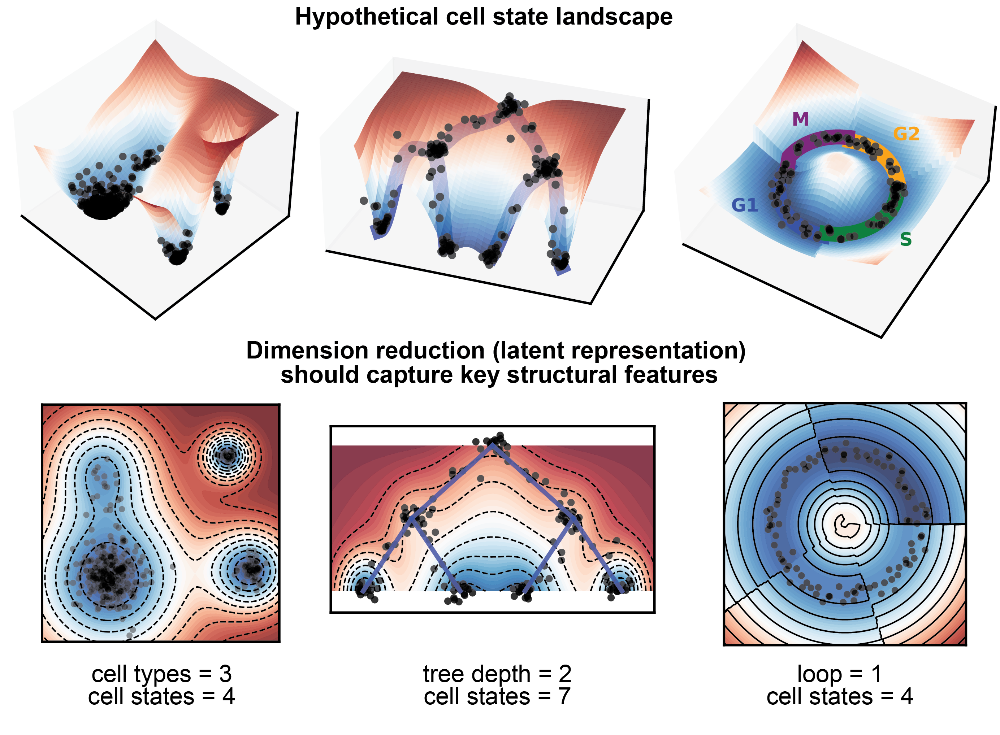
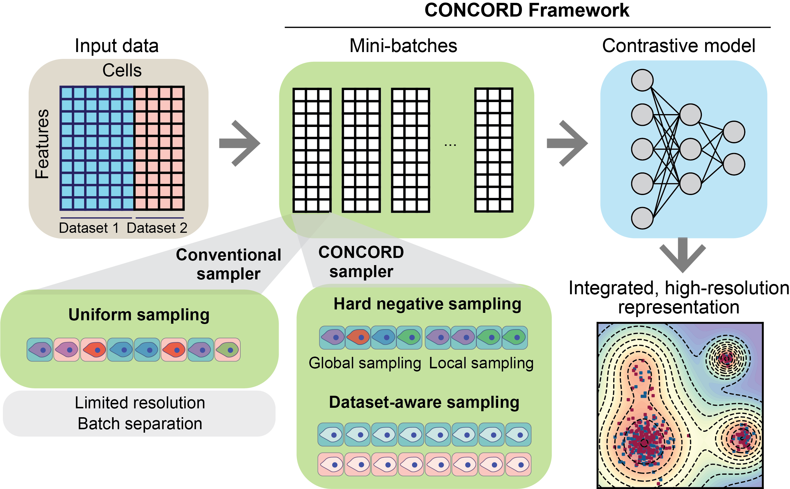
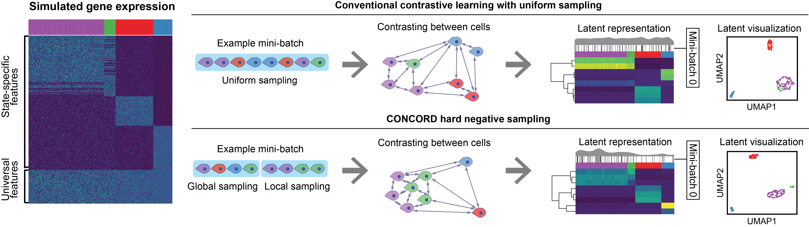
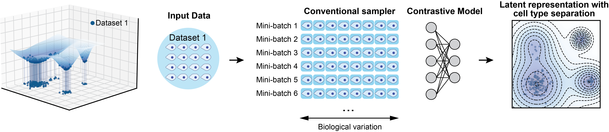
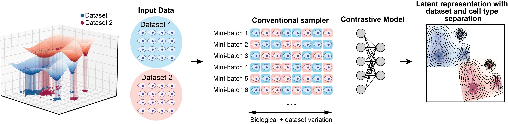
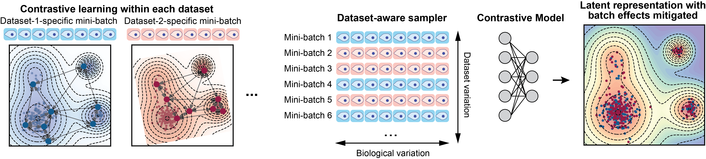
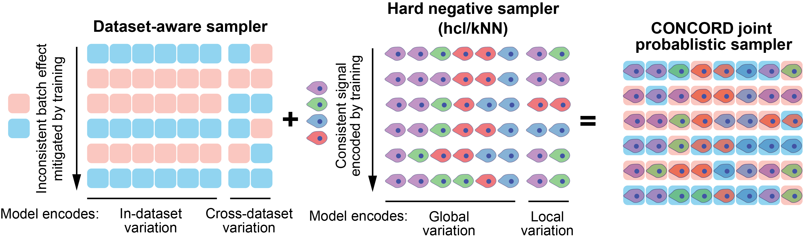
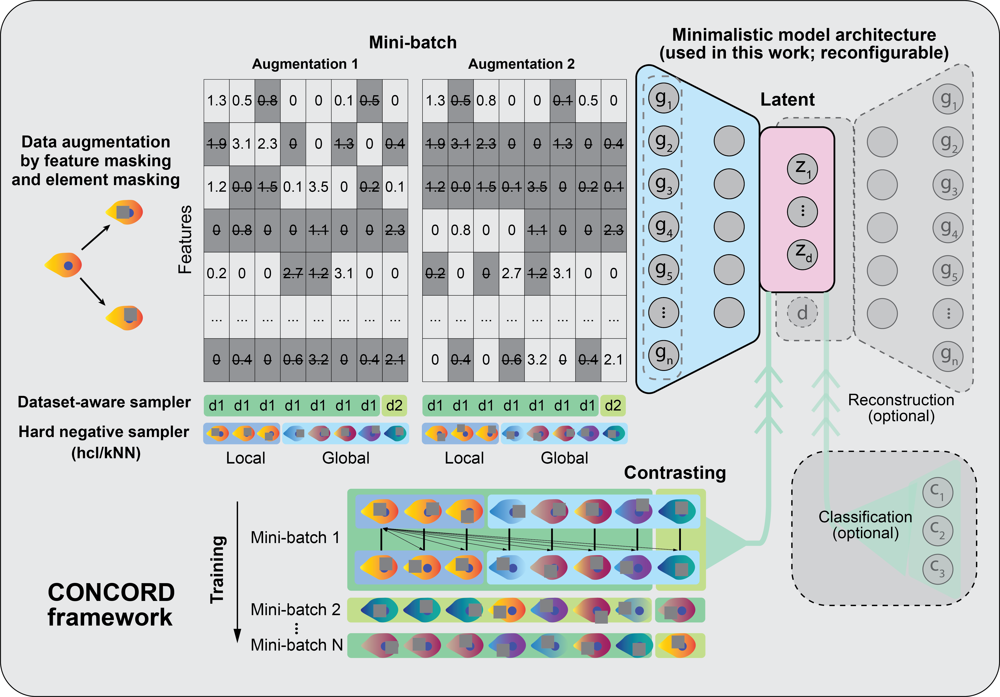

# The CONCORD Framework

## What Does CONCORD Do?

CONCORD addresses three foundamental challenges in single-cell data analysis — dimensionality reduction, denoising, and data integration—within a single unified framework. Operating in a fully unsupervised manner, it generates denoised, high-resolution, and batch-corrected embeddings that faithfully capture the structure of the underlying cell state landscape.

{width="60%"}

In addition to its core functionality, CONCORD supports a range of downstream tasks, including cell type classification, doublet detection, cross-dataset projection, and annotation-guided representation learning. It also provides tools for simulating single-cell data and benchmarking dimensionality reduction and integration methods.

## What Makes CONCORD Powerful?

CONCORD's core innovation lies in its **mini-batch sampling framework**, which changes the way the model sees the data. Instead of sampling cells uniformly from the data distribution, CONCORD integrates two sampling strategies: hard-negative sampling and dataset-aware sampling. The former significantly improves the resolution of cell states, while the latter allows the model to integrate across experimental batches, technologies, or even species. With a minimalistic one-hidden-layer neural network, CONCORD achieves state-of-the-art performance.

  {width="60%"}

- **Hard-negative sampling:**  
  Unlike conventional uniform samplers, the hard-negative sampler allows the model to explore local regions of the landscape while maintaining a global perspective. This enables the model to learn subtle distinctions among closely related cell states. We implemented two modes of hard-negative sampling: the **`hcl`** mode, which implements the hard-negative sampling algorithm from Robinson et al., and the **`kNN`** mode, which explicitly samples cells from within the kNN neighborhood.

    {width="95%"}

- **Dataset-Aware Sampling:**  
  When applied to a single dataset, contrastive learning effectively captures biological variation in the latent space: 
  {width="90%"}

    However, with uniform sampling across multiple datasets, both biological and dataset-specific variations are encoded, leading to latent spaces that separate by dataset as well as cell type:
    {width="90%"}
  
    To address this, we also introduce a dataset-aware sampler that restricts mini-batches to a single dataset, ensuring contrasts reflect only biological differences, as in the single-dataset setting:
    {width="90%"}

    Dataset-specific biases are further diminished through random mini-batch shuffling: if such signals are encoded in one batch, they are disrupted and overwritten by subsequent mini-batches from other datasets. Consequently, only biologically meaningful signals, such as gene co-expression patterns, persist throughout training, resulting in a latent space that reflects biological variation with minimal batch effects. Importantly, this strategy of removing batch effect imposes no assumptions on the structure of the data beyond the existence of shared biological programs across datasets.

- **Joint probablistic Sampling:**  
  Both the neighborhood-aware and dataset-aware samplers follow a unified principle: probabilistically structuring mini-batches to balance global biological diversity with local and dataset-specific variation. We integrate both samplers into a joint sampling framework, where the likelihood of selecting a cell satisfies both sampling schemes:

    {width="60%"} 

## The CONCORD Framework

CONCORD supports custom model architectures, such as deep neural networks, with optional objectives like reconstruction or classification. Alternatively, you can integrate our sampler [see API](../api/model/#concord.model.ConcordSampler) into your custom model architecture. In our study, we benchmarked a minimalistic single-hidden-layer encoder.

{width="70%"}

