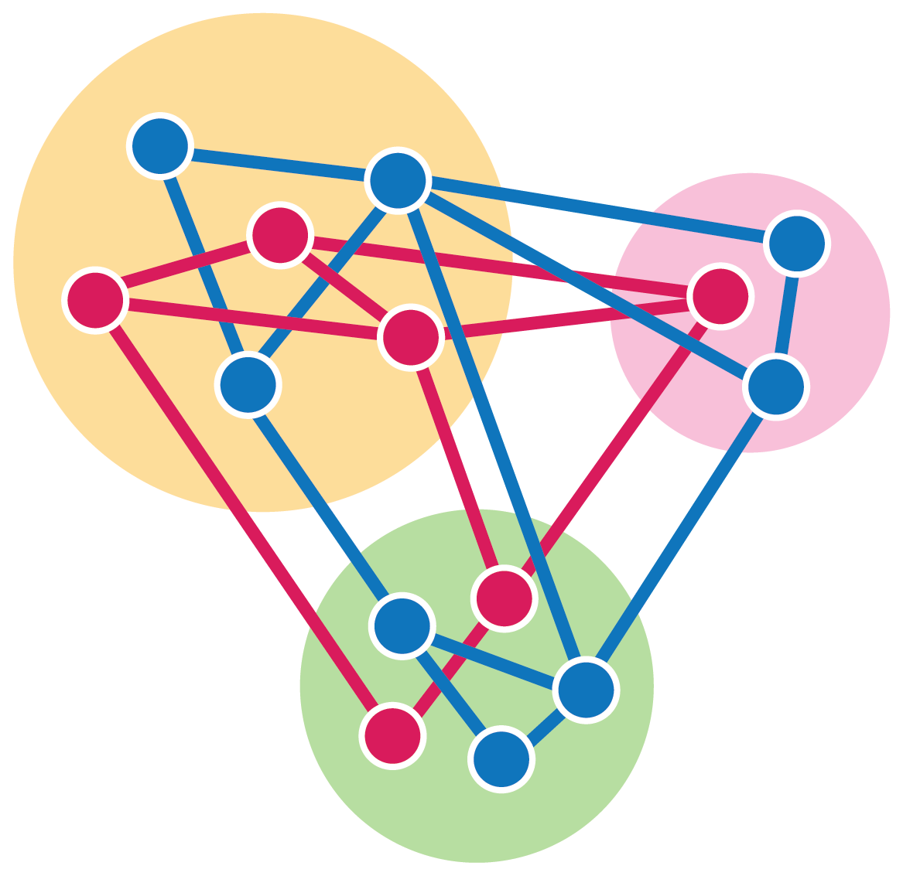

# Getting started with CONCORD { width=80, height=80 }

## Description

**Batch integration**, **denoising**, and **dimensionality reduction** remain fundamental challenges in single-cell data analysis. While many machine learning tools aim to overcome these challenges by engineering model architectures, we use a different strategy, building on the insight that optimized mini-batch sampling during training can profoundly influence learning outcomes. We present **CONCORD (COntrastive learNing for Cross-dOmain Reconciliation and Discovery)**, a self-supervised learning approach that implements a unified, probabilistic data sampling scheme combining neighborhood-aware and dataset-aware sampling: the former enhancing resolution while the latter removing batch effects. Using only a minimalist one-hidden-layer neural network and contrastive learning, CONCORD achieves state-of-the-art performance without relying on deep architectures, auxiliary losses, or supervision. It generates high-resolution cell atlases that seamlessly integrate data across batches, technologies, and species, without relying on prior assumptions about data structure. The resulting latent representations are denoised, interpretable, and biologically meaningful—capturing gene co-expression programs, resolving subtle cellular states, and preserving both local geometric relationships and global topological organization. We demonstrate CONCORD’s broad applicability across diverse datasets, establishing it as a general-purpose framework for learning unified, high-fidelity representations of cellular identity and dynamics.

---

## Installation

It is recommended to use [conda](https://conda.io/projects/conda/en/latest/user-guide/install/index.html) to create and set up a clean virtual environment for CONCORD.

### **1. Install PyTorch**
You must install the correct version of PyTorch based on your system's CUDA setup. Follow the instructions on the [official PyTorch website](https://pytorch.org/get-started/locally/).

- **For CPU:**
  ```bash
  pip install torch torchvision torchaudio
  ```
- **For CUDA (adjust based on your GPU version):**
  ```bash
  pip install torch torchvision torchaudio --index-url https://download.pytorch.org/whl/cu118
  ```

### **2. Install CONCORD (Stable or Development)**
#### **Stable Version (PyPI)**
```bash
pip install concord-sc
```

#### **Development Version (GitHub)**
```bash
pip install git+https://github.com/Gartner-Lab/Concord.git
```

---

## **Optional Installations**

### (Recommended) Enable Additional Functionalities
For **GO enrichment, benchmarking, and R integration**, install:
```bash
pip install "concord-sc[optional]"
```

### (Recommended) Install FAISS for Accelerated KNN Search
> **Note:** If using **Mac**, you may need to disable FAISS when running Concord:
> ```python
> cur_ccd = ccd.Concord(adata=adata, input_feature=feature_list, use_faiss=False, device=device)
> ```

- **FAISS with GPU:**
  ```bash
  pip install faiss-gpu
  ```
- **FAISS with CPU:**
  ```bash
  pip install faiss-cpu
  ```

### (Optional) Integration with VisCello
CONCORD integrates with the **R package VisCello**, a tool for interactive visualization.  
To explore results interactively, visit [VisCello GitHub](https://github.com/kimpenn/VisCello) for more details.

---

## Getting Started

Concord integrates seamlessly with `anndata` objects. 
Single-cell datasets, such as 10x Genomics outputs, can easily be loaded into an `annData` object using the [`Scanpy`](https://scanpy.readthedocs.io/) package. If you're using R and have data in a `Seurat` object, you can convert it to `anndata` format by following this [tutorial](https://qinzhu.github.io/Concord_documentation/). 
In this quick-start example, we'll demonstrate CONCORD using the `pbmc3k` dataset provided by the `scanpy` package.

### Load package and data

```python
# Load required packages
import concord as ccd
import scanpy as sc
import torch
# Load and prepare example data
adata = sc.datasets.pbmc3k_processed()
adata = adata.raw.to_adata()  # Store raw counts in adata.X, by default Concord will run standard total count normalization and log transformation internally, not necessary if you want to use your normalized data in adata.X, if so, specify 'X' in cur_ccd.encode_adata(input_layer_key='X', output_key='Concord')
```

### Run CONCORD:

```python
# Set device to cpu or to gpu (if your torch has been set up correctly to use GPU), for mac you can use either torch.device('mps') or torch.device('cpu')
device = torch.device('cuda:0' if torch.cuda.is_available() else 'cpu')

# (Optional) Select top variably expressed/accessible features for analysis (other methods besides seurat_v3 available)
feature_list = ccd.ul.select_features(adata, n_top_features=5000, flavor='seurat_v3')

# Initialize Concord with an AnnData object, skip input_feature to use all features
cur_ccd = ccd.Concord(adata=adata, input_feature=feature_list, device=device) 

# If integrating data across batch, simply add the domain_key argument to indicate the batch key in adata.obs
# cur_ccd = ccd.Concord(adata=adata, input_feature=feature_list, domain_key='batch', device=device) 

# Encode data, saving the latent embedding in adata.obsm['Concord']
cur_ccd.encode_adata(output_key='Concord')
```

### Visualization:

CONCORD latent embeddings can be directly used for downstream analyses such as visualization with UMAP and t-SNE or constructing k-nearest neighbor (kNN) graphs. Unlike PCA, it is important to utilize the full CONCORD latent embedding in downstream analyses, as each dimension is designed to capture meaningful and complementary aspects of the underlying data structure.

```python
ccd.ul.run_umap(adata, source_key='Concord', result_key='Concord_UMAP', n_components=2, n_neighbors=15, min_dist=0.1, metric='euclidean')

# Plot the UMAP embeddings
color_by = ['n_genes', 'louvain'] # Choose which variables you want to visualize
ccd.pl.plot_embedding(
    adata, basis='Concord_UMAP', color_by=color_by, figsize=(10, 5), dpi=600, ncols=2, font_size=6, point_size=10, legend_loc='on data',
    save_path='Concord_UMAP.png'
)
```

The latent space produced by CONCORD often capture complex biological structures that may not be fully visualized in 2D projections. We recommend exploring the latent space using a 3D UMAP to more effectively capture and examine the intricacies of the data. For example:

```python
ccd.ul.run_umap(adata, source_key='Concord', result_key='Concord_UMAP_3D', n_components=3, n_neighbors=15, min_dist=0.1, metric='euclidean')

# Plot the 3D UMAP embeddings
col = 'louvain'
fig = ccd.pl.plot_embedding_3d(
    adata, basis='Concord_UMAP_3D', color_by=col, 
    save_path='Concord_UMAP_3D.html',
    point_size=3, opacity=0.8, width=1500, height=1000
)
```

---

## License

This project is licensed under the **MIT License**.  
See the [LICENSE](https://github.com/Gartner-Lab/Concord/blob/main/LICENSE.md) file for details.

## Citation

If you use **CONCORD** in your research, please cite the following preprint:

**"Revealing a coherent cell state landscape across single-cell datasets with CONCORD"**  
[*bioRxiv*, 2025](https://www.biorxiv.org/content/10.1101/2025.03.13.643146v1)

